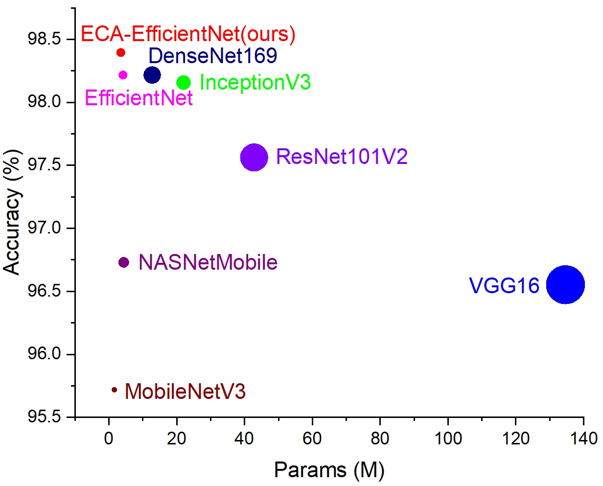
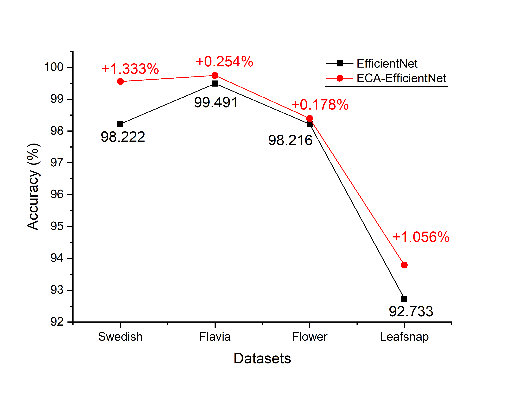
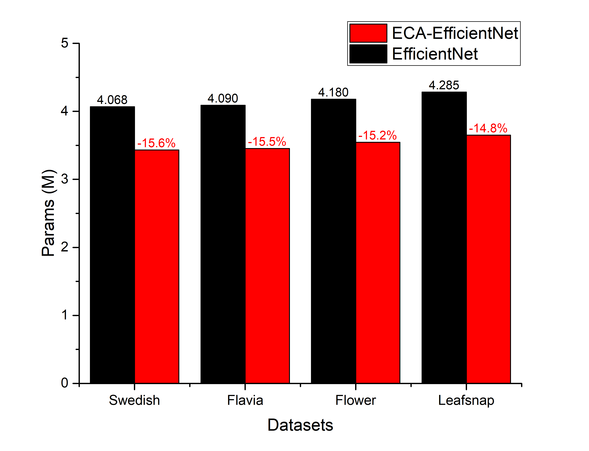

# ECA-EfficientNet  (TensorFlow and Keras)
Paper: Plant Species Recognition using EfficientNet with Efficient Channel Attention
## Introduction

Our ECA-EfficientNet has higher accuracy and lower model complexity than previous Convolutional Neural Networks.

Our ECA-EfficientNet can further improve accuracy, by up to 1.3%.

Our ECA has better parameter efficiency, which is reduced by approximately 15%.

## ECA-MBConv


Structure of original MBConv and our ECA-MBConv.

## Requirements

```bash
pip install pillow

pip install matplotlib

pip install scikit-learn

pip install tensorflow-addons

pip install tensorflow-gpu

conda install cudnn
```
## Start Up
You can run the train.py to train or evaluate as follow:
``` python
python train.py 
python train.py --epoch 100 --lr 5e-5 --data flower --af swish --at eca --batch_size 32 --img_size 224
```

## Contact Information
If you have any suggestion or question, you can leave a message here or contact us directly: guangjinzheng@qq.com . Thanks for your attention!
